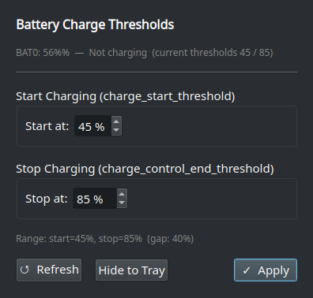

# thresholdctl-gui — ThinkPad Battery Threshold GUI (Qt6)

Qt6 desktop tool to read and write ThinkPad battery charge thresholds, with system tray icon and presets.



- `/sys/class/power_supply/BAT0/charge_start_threshold`
- `/sys/class/power_supply/BAT0/charge_control_end_threshold`

## Features

- Read/write start and stop thresholds
- **Pause Charging** toggle (UI + tray) — holds battery at current level without unplugging AC. Uses `charge_behaviour = inhibit-charge` when kernel supports it, falls back to a temporary end-threshold adjustment (original threshold restored on resume, state persisted via `QSettings`).
- System tray icon with live battery %, charging indicator, and current thresholds in tooltip
- Tray menu with preset profiles (Conservative / Balanced / Plugged-in / Full)
- Close-to-tray (window hides; quit from tray menu)
- `--tray` / `--hidden` flag to start minimized (for autostart)

## Build & Install

### Dependencies
```bash
# Debian/Ubuntu
sudo apt install qt6-base-dev build-essential

# Arch
sudo pacman -S qt6-base base-devel
```

### Quick install with setuid root
```bash
chmod +x install-setuid.sh
./install-setuid.sh /usr/local/bin/thresholdctl-gui
```

Install path is required (no default).

Builds with `qmake6`/`qmake`, installs binary `4755` (setuid root) so GUI can write sysfs without sudo, and installs the `.desktop` entry.

### Manual build
```bash
qmake6 thinkpad-battery-thresholds.pro     # or: qmake
make -j$(nproc)
sudo install -o root -g root -m 4755 thresholdctl-gui /usr/local/bin/thresholdctl-gui
```

## Usage

Launch from app menu or run `thresholdctl-gui`. Use `thresholdctl-gui --tray` to start hidden (useful for autostart entries).

Presets:
- **Conservative:** 40 / 80
- **Balanced:** 60 / 90
- **Plugged in:** 75 / 80
- **Full:** 96 / 100

## Security note

Setuid is the simplest path for a personal machine. Alternatives:
- **polkit rule** to call a helper without setuid.
- **udev rule** to grant a group write access to the sysfs files.

## License

MIT — see [LICENSE](LICENSE).
